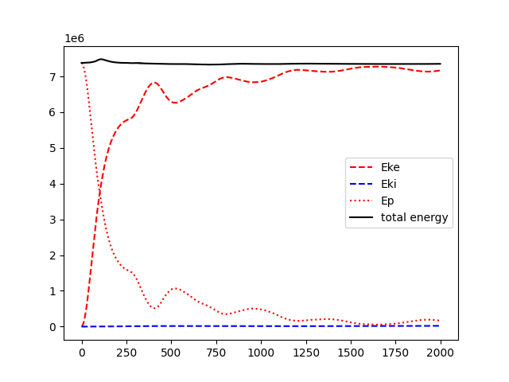

# PIC-2D
2D PIC simulation

# 1. Basic equations
Low index $i,j$ denotes number nodes and low index $p$ denotes number of particles. The number of nodes is $N_x,N_y$.
## 1.1 Gather
Suppose we have a field $E(\vec{x}),\vec{E}_{ij}$. For $p-th$ particle, its position is $x_p,y_p$, then

$$I={\rm int}\left(\frac{x_p-x_{\rm min}}{dx}\right),~J={\rm int}\left(\frac{y_p-y_{\rm min}}{dy}\right),~\Delta x=\frac{x_p-x_I}{dx},~\Delta y=\frac{y_p-y_J}{dy},$$

$$E_{px}=(1-\Delta x)(1-\Delta y)E_{x,ij}+\Delta x(1-\Delta y)E_{x,i+1,j}+(1-\Delta x)\Delta yE_{x,i,j+1}+\Delta x\Delta yE_{x,i+1,j+1}$$

$$E_{py}=(1-\Delta x)(1-\Delta y)E_{y,ij}+\Delta x(1-\Delta y)E_{y,i+1,j}+(1-\Delta x)\Delta yE_{y,i,j+1}+\Delta x\Delta yE_{y,i+1,j+1}$$

$$\vec{E}_ p=(1-\Delta x)(1-\Delta y)\vec{E}_ {ij}+\Delta x(1-\Delta y)\vec{E}_ {i+1,j}+(1-\Delta x)\Delta y\vec{E}_ {i,j+1}+\Delta x\Delta y\vec{E}_{i+1,j+1}$$

## 1.2 Scatter
Suppose we konw the position of a particle. We need to scatter the quantity of particle to surrounding nodes.

$$I={\rm int}\left(\frac{x_p-x_{\rm min}}{dx}\right),~J={\rm int}\left(\frac{y_p-y_{\rm min}}{dy}\right),~\Delta x=\frac{x_p-x_I}{dx},~\Delta y=\frac{y_p-y_J}{dy},$$

$$E_{x,ij}=(1-\Delta x)(1-\Delta y)E_{px},E_{x,i+1,j}=\Delta x(1-\Delta y)E_{px},E_{x,i,j+1}=(1-\Delta x)\Delta yE_{px},E_{x,i+1,j+1}=(1-\Delta x)(1-\Delta y)E_{px}$$

$$\vec{E}_ {ij}=(1-\Delta x)(1-\Delta y)\vec{E}_ {p},\vec{E}_ {i+1,j}=\Delta x(1-\Delta y)\vec{E}_ {p},\vec{E}_ {i,j+1}=(1-\Delta x)\Delta y\vec{E}_ {p},\vec{E}_ {i+1,j+1}=(1-\Delta x)(1-\Delta y)\vec{E}_{p}$$

## 1.3 Finite Difference Method
Possion equation is $\nabla^2\phi=-4\pi\rho$, which means

$$\frac{\phi_{i+1,j}+\phi_{i-1,j}-2\phi_{ij}}{dx^2}+\frac{\phi_{i,j+1}+\phi_{i,j-1}-2\phi_{ij}}{dy^2}=-4\pi\rho_{ij}$$

$$\frac{\phi_{i+1,j}+\phi_{i-1,j}}{dx^2}+\frac{\phi_{i,j+1}+\phi_{i,j-1}}{dy^2}-(\frac{2}{dx^2}+\frac{2}{dy^2})\phi_{ij}=-4\pi\rho_{ij}$$

$$\frac{\phi_{i+1,j}+\phi_{i-1,j}}{dx^2}+\frac{\phi_{i,j+1}+\phi_{i,j-1}}{dy^2}+4\pi\rho_{ij}=(\frac{2}{dx^2}+\frac{2}{dy^2})\phi_{ij}$$

$$\phi_{ij} = \left[\frac{\phi_{i+1,j}+\phi_{i-1,j}}{dx^2}+\frac{\phi_{i,j+1}+\phi_{i,j-1}}{dy^2}+4\pi\rho_{ij}\right]/(\frac{2}{dx^2}+\frac{2}{dy^2})$$

$$\phi_i = \frac{1}{2}(\phi_{i+1}+\phi_{i-1}+4\pi\rho_idx^2)$$

For periodic boundary conditions, 

$$\phi_0=\phi_{Nx-1},~\phi_{Nx-1}=\frac{1}{2}(\phi_{Nx-2}+\phi_1+4\pi\rho_{Nx-1}dx^2)$$

Now we have the potential, we can calculate the electric field, $$E=-\frac{\partial\phi}{\partial x}$$.

$$E_i=-\frac{\phi_{i+1}-\phi_{i-1}}{2dx},~~~ E_0=\frac{\phi_2-4\phi_1+3\phi_0}{2dx},~~~ E_{Nx-1}=-\frac{\phi_{Nx-3}-4\phi_{Nx-2}+3\phi_{Nx-1}}{2dx}$$

## 1.4 Leap frog method
The position of particles are in integer time step, and the velocity of particles are in half-integer time step.

$$v_p^{i+1/2}=v_p^{i-1/2}+\frac{qE_p^i}{m}dt,~~~ x_p^{i+1}=x_p^i+v_p^{i+1/2}dt$$

## 1.5 Linear equations
C++ library Eigen: https://eigen.tuxfamily.org/dox/GettingStarted.html

$$\begin{matrix}
&\phi_{Nx-1}-2\phi_0+\phi_{1}=-4\pi\rho_0dx^2\\
&\phi_{i-1}-2\phi_i+\phi_{i+1}=-4\pi\rho_idx^2\\
&\phi_{Nx-2}-2\phi_{Nx-1}+\phi_{1}=-4\pi\rho_{Nx-1}dx^2
\end{matrix}\Rightarrow \begin{matrix}
&\phi_{Nx-2}-2\phi_0+\phi_{1}=-4\pi\rho_0dx^2\\
&\phi_{Nx-1}-2\phi_1+\phi_2=-4\pi\rho_1dx^2\\
&\phi_{i-1}-2\phi_i+\phi_{i+1}=-4\pi\rho_idx^2\\
&\phi_{Nx-3}-2\phi_{Nx-2}+\phi_0=-4\pi\rho_{Nx-2}dx^2\\
&\phi_{Nx-2}-2\phi_{Nx-1}+\phi_{0}=-4\pi\rho_{Nx-1}dx^2
\end{matrix}\Rightarrow A\cdot\vec{\phi}=\vec{b}$$

$$A=
\begin{pmatrix}
&-2,&1,&0,&0,&\cdots,&0,&0,&1\\
&1,&-2,&1,&0,&\cdots,&0,&0,&0\\
&0,&1,&-2,&1,&\cdots,&0,&0,&0\\
&\cdots\\
&0,&0,&0,&0,&\cdots,&1,&-2,&1\\
&1,&0,&0,&0,&\cdots,&0,&1,&-2
\end{pmatrix},b=-4\pi dx^2\begin{pmatrix}
\rho_0\\
\rho_1\\
\rho_2\\
\cdots\\
\rho_{Nx-2}\\
\rho_{Nx-1}
\end{pmatrix}
$$

We cannot use LDLT decomposition method if $A$ is asymmetric.

# 2. results
## Energy conservation

